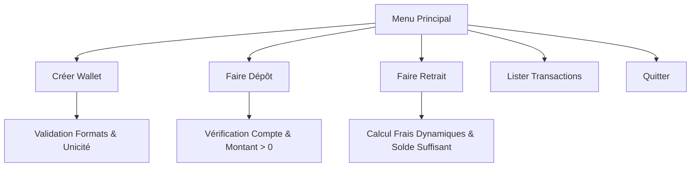

# 🎓 Présentation Technique : Partie A — Les Fondamentaux du PHP Procédural
> **Projet :** Gestion de Portefeuille Électronique (E-Wallet)  
> **Auteur :** Équipe de Développement / Formateur  
> **Jalon :** Sprint 1 / Version 1.0.0

---

## 💻 Introduction et Objectifs Pédagogiques

Ce document sert de support de présentation pour la **Partie A** du projet E-Wallet. Il détaille l'approche procédurale stricte, les contraintes algorithmiques et les règles de validation fondamentales appliquées lors du premier sprint.

---



---

## 🛝 SLIDE 1 : Titre de la Présentation

### 📺 Visuel (Sur l'écran)
```text
┌────────────────────────────────────────────────────────┐
│             SYSTÈME E-WALLET — SPRINT 1                │
│       Les Fondamentaux du PHP Procédural en Console    │
├────────────────────────────────────────────────────────┤
│  • Stockage en mémoire (sans base de données)          │
│  • Algorithmique pure et manipulation manuelle         │
│  • Découpage fonctionnel sans classes (POO)            │
└────────────────────────────────────────────────────────┘
```

### 🗣️ Exposé (À l'oral)
> *"Bonjour à tous. Nous allons débuter par la présentation de la Partie A de notre projet E-Wallet. L'objectif de ce premier jalon est de poser des fondations algorithmiques solides. Nous développons une application console en PHP, sans base de données externe et sans programmation orientée objet, pour nous concentrer exclusivement sur la logique pure, les structures de contrôle et la gestion des données en mémoire."*

---

## 🛝 SLIDE 2 : Les Objectifs Pédagogiques Clés

### 📺 Visuel (Sur l'écran)
*   **Tableaux Numériques Indexés** : Utilisés comme base de données temporaire pour stocker les portefeuilles et les transactions.
*   **Fonctions sur les Chaînes** : Validation fine des saisies (longueur, présence de caractères non numériques, préfixes).
*   **Fonctions Nommées et Scope** : Structuration du code pour isoler les responsabilités, passage d'arguments et modification par référence.
*   **Algorithmes de Recherche** : Parcours manuels sans fonctions PHP prédéfinies.

### 🗣️ Exposé (À l'oral)
> *"Ce Sprint met l'accent sur trois piliers d'apprentissage : premièrement, l'usage rigoureux des tableaux PHP pour simuler une base de données en mémoire. Deuxièmement, la manipulation de chaînes de caractères pour valider les numéros de téléphone et codes secrets. Enfin, le découpage en fonctions nommées avec une attention particulière portée au Scope (la portée des variables) et au passage de tableaux par référence pour enregistrer les modifications."*

---

## 🛝 SLIDE 3 : Contraintes Techniques Strictes de la Partie A

### 📺 Visuel (Sur l'écran)
> [!IMPORTANT]
> **Interdiction d'utiliser les fonctions PHP natives sur les tableaux !**
> - Pas de `in_array()`, `array_search()`, `array_push()`, `array_filter()`, etc.
> - Obligation d'implémenter les recherches et ajouts manuellement via des boucles `for` ou `foreach`.

*   **Mode Console** : Lecture des entrées clavier via `fgets(STDIN)` et affichage avec `echo`.
*   **Inclusions Classiques** : Utilisation de `require_once` directs pour lier les modules.
*   **Sans Namespace** : Organisation globale des noms de fonctions.

### 🗣️ Exposé (À l'oral)
> *"Pour valider les compétences algorithmiques de base, nous nous sommes imposé une contrainte majeure : interdiction absolue d'utiliser les fonctions natives PHP comme in_array ou array_push. Chaque recherche d'existence de numéro de téléphone ou de code secret, ainsi que chaque insertion, doit être programmée manuellement à l'aide de boucles. Cela force à comprendre ce qui se passe sous le capot de PHP avant d'automatiser."*

---

## 🛝 SLIDE 4 : Règles de Gestion & Validation Strictes

### 📺 Visuel (Sur l'écran)

| Paramètre | Règle de validation |
| :--- | :--- |
| **Téléphone** | Obligatoire, unique, composé de 9 chiffres, préfixe sénégalais valide (`77`, `78`, `76`, `70`, `75`). |
| **Code Secret** | Obligatoire, unique, composé d'exactement 4 chiffres. |
| **Solde Initial** | Supérieur ou égal à 0. |
| **Montants** | Strictement supérieurs à 0 pour les dépôts et retraits. |

*Exemple de code manuel de validation (Partie A) :*
```php
function validerTelephoneManuel($telephone, &$wallets) {
    if (strlen($telephone) !== 9) return false;
    // Parcours manuel pour vérifier l'unicité
    foreach ($wallets as $w) {
        if ($w['telephone'] === $telephone) {
            return false; // Déjà existant
        }
    }
    return true;
}
```

### 🗣️ Exposé (À l'oral)
> *"Notre système doit être extrêmement robuste. Pour cela, la saisie utilisateur subit plusieurs étapes de validation. Par exemple, pour le numéro de téléphone, non seulement nous vérifions qu'il s'agit de 9 chiffres et qu'il commence par un préfixe autorisé au Sénégal, mais nous devons aussi parcourir manuellement le tableau de nos wallets existants pour vérifier qu'aucun autre compte n'utilise déjà ce numéro."*

---

## 🛝 SLIDE 5 : La Gestion des Retraits et Frais Dynamiques

### 📺 Visuel (Sur l'écran)
Les retraits appliquent un calcul de frais par paliers :
- **0 à 10 000 CFA** : Frais fixes de **200 CFA**.
- **10 001 à 100 000 CFA** : Frais fixes de **500 CFA**.
- **Plus de 100 000 CFA** : **1% du montant**, avec un **plafond maximum de 5 000 CFA**.

> [!WARNING]
> Le solde du client doit couvrir le montant demandé **ET** les frais calculés.

```text
Solde disponible = Solde actuel - (Montant Retrait + Frais)
```

### 🗣️ Exposé (À l'oral)
> *"La règle concernant le retrait est l'une des plus complexes du système. Les frais sont calculés de manière dynamique par paliers. Pour les petits retraits, les frais sont forfaitaires (200 ou 500 CFA). Au-delà de 100 000 CFA, nous prélevons 1% mais nous appliquons un plafond de 5000 CFA maximum. Le validateur s'assure en amont que le solde total du wallet permet de payer à la fois la somme retirée et les frais associés."*

---

## 🛝 SLIDE 6 : Conclusion & Bilan du Sprint 1

### 📺 Visuel (Sur l'écran)
*   **Livrable Fonctionnel** : Un code stable, testé et validé en version `v1.0.0`.
*   **Qualité Algorithmique** : Logique de contrôle implémentée à la main (boucles pures).
*   **Limites Constatées** :
    *   Code verbeux dû à l'absence de fonctions natives.
    *   Risques de collisions de noms de fonctions à cause de l'absence de namespaces.
*   **Étape Suivante** : Refactorisation moderne (Partie B).

### 🗣️ Exposé (À l'oral)
> *"En conclusion, ce premier jalon nous a permis de livrer une application console totalement fonctionnelle en version 1.0.0. Bien que le code fonctionne parfaitement, l'absence de namespaces et l'interdiction des fonctions natives rendent la maintenance plus complexe et le code verbeux. C'est ce qui motive la transition vers la Partie B, où nous allons professionnaliser et optimiser cette base de code."*
