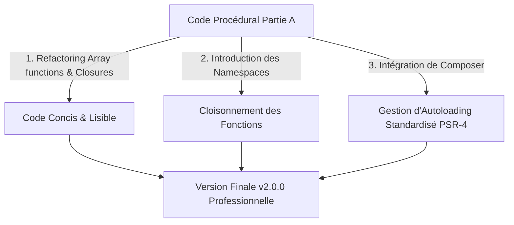

# 🎓 Présentation Technique : Partie B — Professionnalisation et Outils Modernes
> **Projet :** Gestion de Portefeuille Électronique (E-Wallet)  
> **Auteur :** Équipe de Développement  
> **Jalon :** Sprint 2 / Version 2.0.0

---

## 📋 Table des Matières

Ce document constitue le support de présentation technique pour la **Partie B** du projet E-Wallet. Il aborde les notions de PHP moderne nécessaires à l'implémentation de la version v2.0.0.



---

## 🛝 SLIDE 1 : Titre de la Présentation

### 📺 Visuel (Sur l'écran)
```text
┌────────────────────────────────────────────────────────┐
│             E-WALLET — SPRINT 2 (PARTIE B)             │
│    Professionnalisation, Architecture & PHP Moderne    │
├────────────────────────────────────────────────────────┤
│  • Fonctions Anonymes, Closures & Arrow Functions      │
│  • Fonctions de Tableaux Natives (array_*)            │
│  • Gestionnaire de Dépendances Composer                │
│  • Écosystème PHP & Namespaces                         │
└────────────────────────────────────────────────────────┘
```

### 🗣️ Exposé (À l'oral)
> *"Bonjour à tous. Après avoir validé les fonctionnalités de base de notre simulateur dans la Partie A, nous allons aujourd'hui aborder la refactorisation et la modernisation de notre base de code. La Partie B introduit des concepts indispensables au développement professionnel en PHP moderne : les fonctions anonymes et closures, les fonctions natives de tableaux pour un code plus déclaratif, et l'intégration de Composer pour automatiser l'autoloading de nos modules à l'aide des Namespaces."*

---

## 🛝 SLIDE 2 : Closures, Fonctions Anonymes & Fonctions Fléchées (Arrow Functions)

### 📺 Visuel (Sur l'écran)
*   **Fonction Anonyme** : Fonction sans nom, utile comme argument de rappel (callback).
*   **Closure (Fermeture)** : Fonction anonyme capable de capturer des variables du scope parent avec le mot-clé `use`.
*   **Arrow Function (PHP 7.4+)** : Syntaxe plus courte (`fn() => expr`) avec capture automatique par valeur du scope parent.

```php
// Exemple 1 : Closure avec 'use' (utilisé dans repository.php)
$found = array_filter($wallets, function(array $w) use ($telephone): bool {
    return $w["telephone"] === $telephone;
});

// Exemple 2 : Arrow function (syntaxe compacte équivalente)
$found = array_filter($wallets, fn(array $w) => $w["telephone"] === $telephone);
```

### 🗣️ Exposé (À l'oral)
> *"Commençons par les fonctions anonymes. Contrairement aux fonctions classiques déclarées de manière globale, une fonction anonyme est créée à la volée et peut être stockée dans une variable ou passée directement comme paramètre à une autre fonction. Une closure pousse ce concept plus loin en permettant de capturer des variables de son contexte parent grâce au mot-clé 'use', comme nous l'avons fait ici avec la variable $telephone. Depuis PHP 7.4, nous disposons également des fonctions fléchées, ou 'arrow functions', qui rendent la syntaxe encore plus épurée en effectuant une capture automatique des variables externes."*

---

## 🛝 SLIDE 3 : Fonctions Natives de Tableaux (`array_*`)

### 📺 Visuel (Sur l'écran)
Comparatif de la recherche et filtrage de données :

#### ❌ Avant (Style Partie A — Parcours manuel)
```php
function trouverWalletManuel(string $telephone, array $wallets): int {
    foreach ($wallets as $index => $w) {
        if ($w["telephone"] === $telephone) {
            return $index;
        }
    }
    return -1;
}
```

####  Après (Style Partie B — Utilisation de fonctions natives)
```php
function trouverWallet(string $telephone, array $wallets): int {
    $found = array_filter($wallets, function(array $w) use ($telephone): bool {
        return $w["telephone"] === $telephone;
    });
    return count($found) === 0 ? -1 : array_keys($found)[0];
}
```

*Principales fonctions utilisées :*
*   `array_filter()` : Isole les éléments correspondant à un critère.
*   `array_map()` : Applique une transformation à chaque élément.
*   `array_keys()` : Récupère les clés du tableau filtré.

### 🗣️ Exposé (À l'oral)
> *"Voici un comparatif concret. Dans la partie A, nous étions obligés d'écrire des boucles foreach pour parcourir les tableaux de wallets et chercher un numéro de téléphone. En Partie B, nous exploitons la puissance des fonctions natives comme array_filter. Le code devient plus expressif et plus proche de la programmation déclarative. Nous combinons array_filter pour filtrer les comptes, count pour vérifier la présence d'au moins un élément, et array_keys pour en extraire la clé exacte."*

---

## 🛝 SLIDE 4 : Le Gestionnaire de Dépendances Composer

### 📺 Visuel (Sur l'écran)
*   **Définition** : Outil indispensable de gestion des packages pour PHP.
*   **Rôles majeurs** :
    1.  Télécharger et installer des bibliothèques externes.
    2.  Résoudre automatiquement les conflits de versions.
    3.  **Générer l'Autoloader** (`vendor/autoload.php`) pour charger automatiquement nos fichiers sans `require` manuels.
*   **Fichier `composer.json` du projet** :
```json
{
    "name": "student/ewallet-console",
    "autoload": {
        "files": [
            "validator.php",
            "repository.php",
            "services.php",
            "controller.php"
        ]
    }
}
```

### 🗣️ Exposé (À l'oral)
> *"Passons à Composer. Composer n'est pas seulement un outil pour installer des librairies tierces, c'est le coeur de l'architecture moderne de PHP. Dans notre projet, nous l'utilisons pour déclarer la configuration de notre application et surtout pour configurer l'autoloading. Au lieu d'avoir des directives 'require_once' éparpillées partout dans notre code, nous disons à Composer de charger automatiquement nos différents fichiers validator, repository, services et controller. Il nous suffit d'inclure vendor/autoload.php une seule fois au début de index.php."*

---

## 🛝 SLIDE 5 : La Plateforme Packagist.org et son Écosystème

### 📺 Visuel (Sur l'écran)
*   **Qu'est-ce que Packagist ?**
    *   Le dépôt principal (Registry) pour Composer.
    *   Regroupe des milliers de packages open-source réutilisables (ex: gestion des dates avec *Carbon*, tests unitaires avec *PHPUnit*, validation avancée, logs, ORM).
*   **Processus d'intégration dans l'écosystème** :

```text
  1. Recherche sur Packagist.org 
  2. Installation locale via 'composer require vendor/package'
  3. Utilisation immédiate dans le code via 'use Vendor\Package'
```

> [!TIP]
> L'utilisation de packages tiers évite de réinventer la roue et accélère le développement en garantissant un code testé par la communauté.

### 🗣️ Exposé (À l'oral)
> *"Packagist.org est le catalogue public centralisé où sont hébergés tous les modules PHP partagés par la communauté internationale. Si nous avions besoin de manipuler des dates complexes, d'envoyer des SMS réels pour notifier le client lors d'un retrait, ou de faire des requêtes API vers des banques, nous n'aurions pas besoin d'écrire ces fonctions complexes nous-mêmes. Il suffirait de chercher le package correspondant sur Packagist, de l'installer d'une simple ligne de commande avec Composer, et d'en importer le namespace dans notre projet."*

---

## 🛝 SLIDE 6 : L'organisation par Namespaces (Espaces de Noms)

### 📺 Visuel (Sur l'écran)
*   **Problème** : Risque de collision de noms si deux fonctions s'appellent de la même façon (ex: `valider()` dans deux modules différents).
*   **Solution** : Les Namespaces structurent les dossiers virtuels du code.

```php
// Fichier validator.php
namespace EWallet\Validator;
function validerNom(string $nom): int { ... }

// Fichier index.php (Point d'entrée)
use EWallet\Controller;
Controller\afficherMenu();
```

*   **Bénéfice** : Clarté, lisibilité et standardisation du code PHP.

### 🗣️ Exposé (À l'oral)
> *"Enfin, parlons des Namespaces. Dans un projet réel de grande envergure, il est fréquent que deux fichiers déclarent des fonctions ou des classes portant le même nom. Les Namespaces résolvent ce problème en créant des espaces de noms distincts, fonctionnant comme des répertoires virtuels. Dans notre projet, nous avons configuré les namespaces EWallet\Validator, EWallet\Repository, EWallet\Service et EWallet\Controller. Le point d'entrée index.php peut ainsi importer précisément les composants dont il a besoin grâce au mot-clé 'use'."*

---

## 🛝 SLIDE 7 : Bilan et Clôture de la Partie B

### 📺 Visuel (Sur l'écran)
*   **Code Nettoyé** : Suppression de toutes les boucles manuelles répétitives au profit des fonctions PHP natives.
*   **Modularité** : Séparation complète de la logique métier (Services), de la donnée (Repository) et de la validation.
*   **Prêt pour la production** : Structure de projet standardisée et versionnée avec Git, prête à accueillir un framework de test ou une base de données MySQL.

> [!NOTE]
> La version `v2.0.0` représente le standard de qualité professionnel attendu pour les architectures de services transactionnels.

### 🗣️ Exposé (À l'oral)
> *"En conclusion, cette Partie B transforme un code purement scolaire de type académique en une architecture logicielle robuste et extensible. Le code est modulaire, sans duplication de logique, et prêt à évoluer vers des fonctionnalités avancées (connexion à une base de données réelle, intégration d'API ou ajout de tests unitaires avec PHPUnit). Nous sommes désormais conformes aux meilleures pratiques de l'industrie PHP moderne. Merci pour votre attention."*
